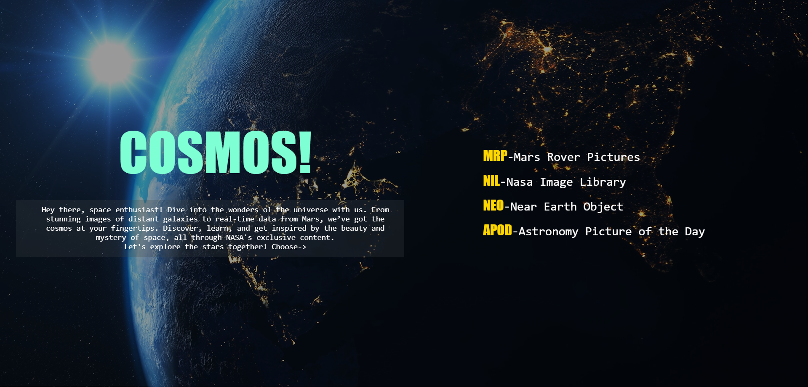

# Cosmos



Welcome to **Cosmos**! This project is a website dedicated to space enthusiasts, providing access to stunning images of distant galaxies, real-time data from Mars, and exclusive content from NASA.

## Table of Contents

- [Introduction](#introduction)
- [Features](#features)
- [Installation](#installation)
- [Usage](#usage)
- [Contributing](#contributing)

## Introduction

Hey there, space enthusiast! Dive into the wonders of the universe. Discover, learn, and get inspired by the beauty and mystery of space, all through NASA's exclusive content. Let’s explore the stars together!

## Features

- **MRP - Mars Rover Pictures**: Explore pictures taken by Mars rovers.
- **NIL - NASA Image Library**: Access a vast library of NASA images.
- **NEO - Near Earth Object**: Get information about near-Earth objects.
- **APOD - Astronomy Picture of the Day**: View the daily astronomy picture curated by NASA.

## Installation

To run this project locally, follow these steps:

1. Clone the repository:
    ```bash
    git clone <repository-url>
    ```
2. Navigate to the project directory:
    ```bash
    cd cosmos
    ```

## Usage

Open `index.html` in your web browser to start exploring the Cosmos website.

## Contributing

Contributions are welcome! Please fork the repository and create a pull request with your changes. For major changes, please open an issue first to discuss what you would like to change.
